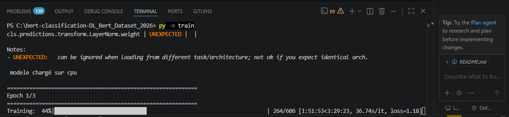
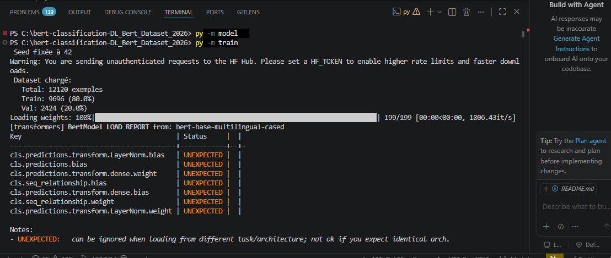

# Devoir 3: Fine-Tuning de BERT

Ce dépôt GitHub contient l'implémentation complète pour le **Devoir Pratique n°3** dans le cadre du cours Transformers et NLP. Notre projet consiste à effectuer le fine-tuning d'un modèle BERT multilingue pré-entraîné (`bert-base-multilingual-cased`) à l'aide d'une boucle d'entraînement PyTorch pure (sans utiliser le Trainer de Hugging Face), puis à déployer une interface de démonstration interactive via Gradio.

## Informations du Binôme & Commits

- **Eudes Exaucé BANIEK**, identifiant GitHub: Eudes-Baniek
- **Denis NGARNDIGUINA**, identifiant GitHub: yothafils

**Note sur le versionnement :** Conformément aux modalités, le développement a été réalisé de manière collaborative. L'historique des commits témoigne d'une répartition et d'une progression continue des contributions.

## Présentation du Dataset Choisi

- **Nom du Dataset :** DL_Bert_Dataset_2026 (Fichier utilisé : `train6.csv`) après suppression d'espace (train 6.csv avant)
- **Tâche associée :** Natural Language Inference (NLI) / Reconnaissance d'Implication Textuelle.

### Statistiques Clés

### Informations générales

Nombre d'exemples : 12120
Nombre de classes : 3

Distribution des classes :
label
0 4176
2 4064
1 3880
Name: count, dtype: int64

Langues présentes :
language
English 6870
Chinese 411
Arabic 401
French 390
Swahili 385
Urdu 381
Vietnamese 379
Russian 376
Hindi 374
Greek 372
Thai 371
Spanish 366
Turkish 351
German 351
Bulgarian 342
Name: count, dtype: int64

Analyse des longueurs
Minimum : 7
Maximum : 259
Moyenne : 48.91
90e percentile : 78
95e percentile : 91
99e percentile : 125

- **Volume total :** 12 120 exemples.
- **Répartition Train / Validation :** Stratification stricte en 80% entraînement (9 696 exemples) et 20% validation (2 424 exemples) pour préserver la distribution des classes.
- **Nombre de classes :** 3 classes distinctes (0: Implication / _Entailment_, 1: Neutre / _Neutral_, 2: Contradiction).
- **Longueur de texte sélectionnée _max_length_ :** Fixée à `128` tokens après analyse de la distribution des longueurs de paires de phrases (prémisse + hypothèse) afin d'éviter la perte d'information tout en optimisant le temps de calcul sur CPU[cite: 13, 79].

## Choix Techniques & Hyperparamètres de Référence

L'architecture repose sur l'intégration du modèle pré-entraîné de Google imbriqué dans une classe de classification personnalisée.

- **Modèle de base :** `bert-base-multilingual-cased` (choisi pour sa robustesse sur les données multilingues et les paires de textes).
- **Optimiseur :** `AdamW` avec un coefficient de dégradation des poids (_weight decay_) de 0.01.
- **Taux d'apprentissage (_Learning Rate_) :** $2 \times 10^{-5}$ ($2e-5$) pour éviter le phénomène d'oubli catastrophique (_catastrophic forgetting_)[cite: 77, 99].
- **Fonction de perte :** `Loss` (alimentée par les indices entiers des classes).

## Structure du Projet

Le dépôt respecte scrupuleusement la hiérarchie logicielle demandée:

bert-classification-DL_Bert_Dataset_2026/
├── data/
│ └── train6.csv
├── checkpoints/
│ ├── best_model.pt
│ └── tokenizer/
├── dataset.py
├── model.py
├── train.py
├── demo.py
├── utils.py
├── requirements.txt
└── README.md

# Cloner le dépôt

#de préférence se placer sur le disque C

git clone https://github.com/Eudes-Baniek/bert-classification-DL_Bert_Dataset_2026.git

# se placer dans le dossier cloné

cd bert-classification-DL_Bert_Dataset_2026

# Installer les dépendances requises

pip install -r requirements.txt

# Lancement de l'entrainement du model

python -m train

# lancer l'interface gradio

python demo.py

# Métriques Finales

(Époque 1)

============================================================
Training: 100%|█████████████████████████████████████████████████████████████████████| 606/606 [3:44:58<00:00, 22.27s/it, loss=1.26]
Validation: 100%|████████████████████████████████████████████████████████████████████████████████| 152/152 [12:26<00:00, 4.91s/it]

Train Loss : 1.0064
Train Accuracy : 48.58%
Val Loss : 0.8788
Val Accuracy : 60.40%
Val F1-Score : 0.6036

Epoch 2/3

Training: 100%|████████████████████████████████████████████████████████████████████| 606/606 [3:20:22<00:00, 19.84s/it, loss=0.971]
Validation: 100%|████████████████████████████████████████████████████████████████████████████████| 152/152 [12:19<00:00, 4.86s/it]

Train Loss: 0.7619
Train Acc: 0.6711
Val Loss: 0.8464
Val Acc: 0.6436
Val F1: 0.6412

============================================================
Epoch 3/3
============================================================
Training: 100%|████████████████████████████████████████████████████████████████████| 606/606 [3:45:17<00:00, 22.31s/it, loss=0.363]
Validation: 100%|██████████████████████████████████████████████████████████████████████████████████████████████████████████████████████████████████████████████████████████████████| 152/152 [13:47<00:00, 5.44s/it]

Train Loss: 0.4802
Train Acc: 0.8067
Val Loss: 1.0101
Val Acc: 0.6374
Val F1: 0.6375

============================================================
Entraînement terminé!
============================================================

# Analyse des résultats

# Difficultés

-L'utilisation du cpu: ce qui nous a concraint de limiter le nombre d'epochs à 3;
-Manque d'espace : Le manque d'espace dans l'ordinateur nous a obligé de libérer l'espace
dans l'ordinateur et reprendre l'entraienent car la saugegarde du meilleur model ne pouvait pas
se faire avec moins de 500M d'espace restant alors que la sauvegarde avait besoin de plus de 600M

**les commits**: les commits sont bien visibles sur l'historique de github

**Exemple d'un commit effectué**

C:\bert-classification-DL_Bert_Dataset_2026>git add train.py
C:\bert-classification-DL_Bert_Dataset_2026>git commit -m "ajout du fichier train.py"
[Eudes 4bbc5fa] ajout du fichier train.py
1 file changed, 327 insertions(+)
create mode 100644 train.py

C:\bert-classification-DL_Bert_Dataset_2026>git push -u origin Eudes
Enumerating objects: 4, done.
Counting objects: 100% (4/4), done.
Delta compression using up to 4 threads
Compressing objects: 100% (3/3), done.
Writing objects: 100% (3/3), 3.28 KiB | 1.09 MiB/s, done.
Total 3 (delta 1), reused 0 (delta 0), pack-reused 0 (from 0)
remote: Resolving deltas: 100% (1/1), completed with 1 local object.
To https://github.com/Eudes-Baniek/bert-classification-DL_Bert_Dataset_2026.git
863fafa..4bbc5fa Eudes -> Eudes
branch 'Eudes' set up to track 'origin/Eudes'.

C:\bert-classification-DL_Bert_Dataset_2026>git branch

- Eudes
  main
  yothafils-data

# Quelques captures d'écrans

